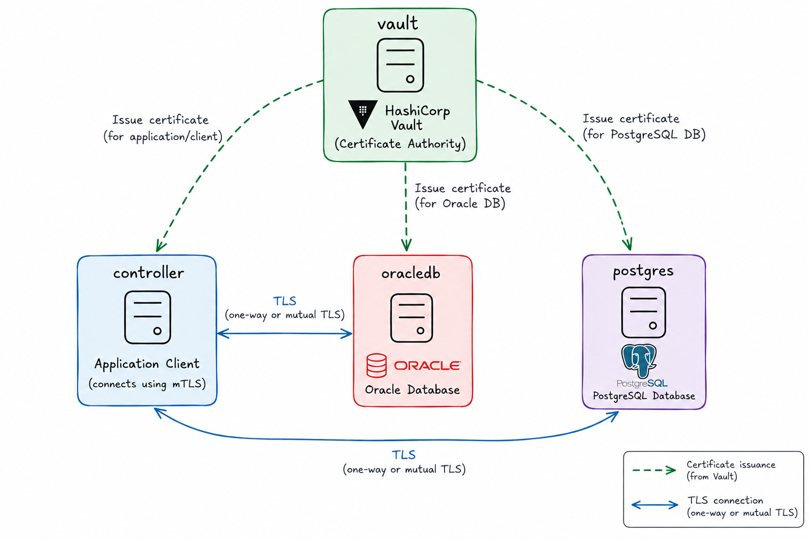
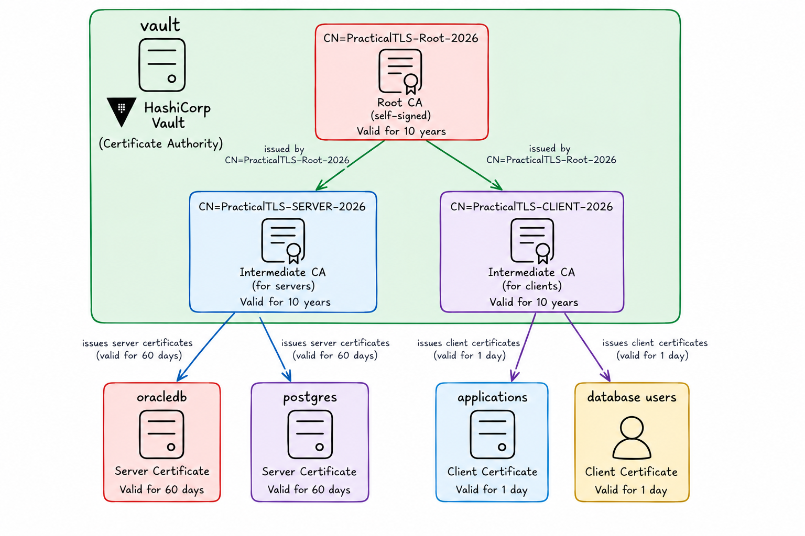

# Author

Ilmar Kerm
ilmar@ilmarkerm.eu
2026

# Prerequisites

Need modern Docker.

# Secrets

All passwords are: demo123
Vault root token is: demo123

# Running

From the "practical-tls" directory (where compose.yaml is located), execute

```
docker compose up
```

After initial setup is done, Oracle DB needs a reboot to activate spfile parameters.

```
docker compose stop
docker compose start
docker compose logs -f
```

NB! Everything with Vault is set up for demo purposes only using a root token and without any access privileges set up. In real deployments you must look into proper authentication (like approles) and access policies.

# Demo setup



# Create Vault structure

```
docker compose exec controller bash /scripts/vault_setup.sh
```

Go to [Vault GUI](http://localhost:8200/) and show the Vault structures created.



DEBUG: If Vault container is restarted or recreated during the test, then have to run destory first before recreating Vault setup. Because in dev mode Vault does not persist anything, but terraform state file remains in place on controller.

```
docker compose exec controller bash /scripts/vault_setup.sh destroy
```

# OracleDB server configuration

First lets create Oracle Wallet and request certificate from Vault

```
docker compose exec oracledb bash /scripts/wallet_create.sh
```

Oracle network connections are taken by listener first, so listener needs to be set up for TLS.

```
docker compose exec oracledb lsnrctl status
docker compose exec oracledb cat /opt/oracle/product/26ai/dbhomeFree/network/admin/listener.ora
docker compose exec oracledb bash /scripts/configure_listener.sh
```

Verify that listener responds to TLS correcly

```
echo -n | openssl s_client -connect localhost:1522 -showcerts
```

But also how Oracle architecture is set up, configuring TLS on listener is not enough, listener hands over the connection to database, TLS also needs to be configured in database.

```
docker compose exec oracledb sqlplus / as sysdba

sho pdbs
sho parameter wallet_root
```

Show sqlnet.ora

```
docker compose exec oracledb cat /opt/oracle/product/26ai/dbhomeFree/network/admin/sqlnet.ora
```

# OracleDB client tests

Download the root certificate from Vault and place it under client system truststore.

```
docker compose exec controller bash /scripts/trust_vault_root.sh
```

Connect from python thin driver

```
docker compose exec controller /root/venv_test/bin/python /scripts/connect_oracle.py
```

Connect from python thick driver

With recent Oralce Instantclient (>21?) it can use OS system trust store and no need to confiugure Oracle Wallet on client side.

```
docker compose exec controller /root/venv_test/bin/python /scripts/connect_oracle_thick.py
docker compose exec controller /root/venv_test/bin/python /scripts/connect_oracle_thick.py --hostname oracledb
docker compose exec controller /root/venv_test/bin/python /scripts/connect_oracle_thick.py --hostname oracledb --server-dn-match-off
```

# PostgreSQL

pg_hba:
hostssl all +dbcert_users all cert
hostssl all all all scram-sha-256

```
ssl = on
ssl_cert_file = '/var/lib/postgresql/server_cert.pem'
ssl_key_file = '/var/lib/postgresql/server_cert.key'
# For client verification
ssl_ca_file = '/var/lib/postgresql/root.pem'
```

/var/lib/postgresql/18/docker/postgresql.conf
/var/lib/postgresql/18/docker/pg_hba.conf
# /var/lib/postgresql/18/docker/pg_ident.conf
kill -SIGHUP 1


Also show tests with psql and sqlplus programs


# Download


