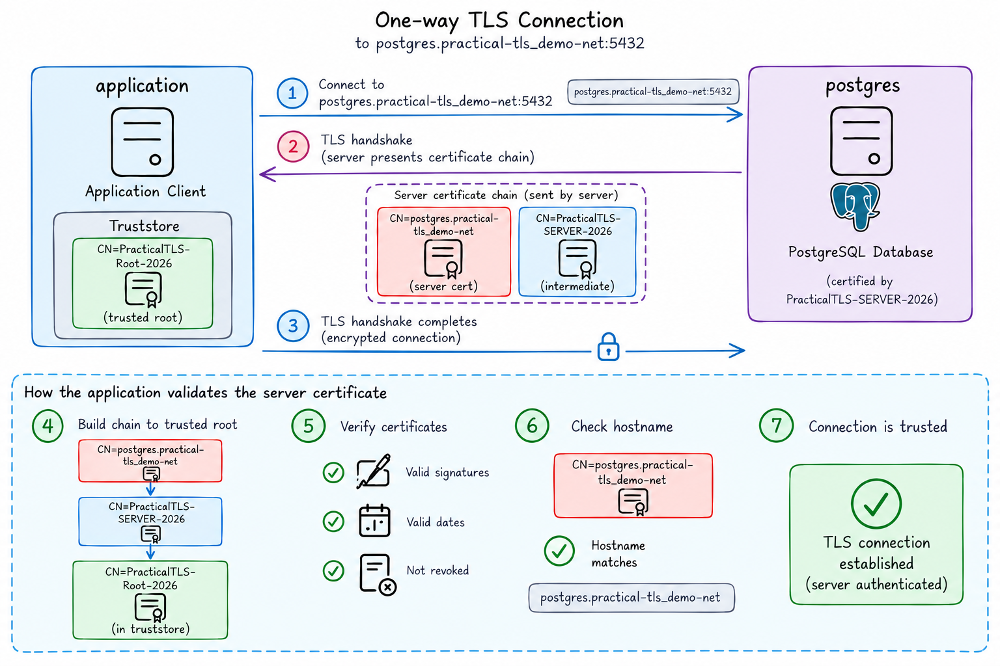
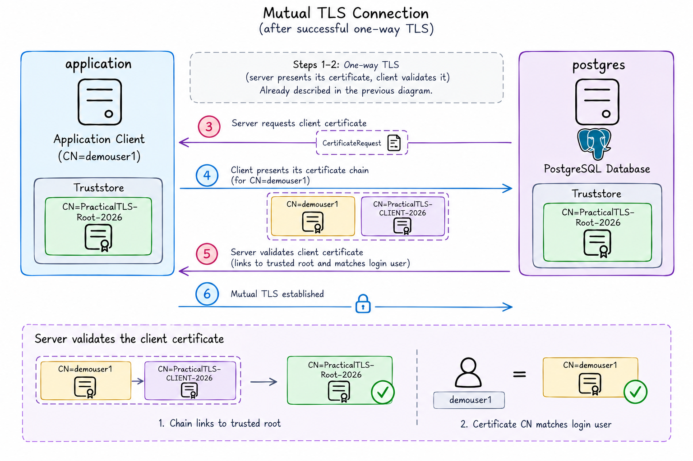

# Author

Ilmar Kerm
ilmar@ilmarkerm.eu
2026

# Prerequisites

Need modern Docker.

# Secrets

All passwords are: demo123
Vault root token is: demo123

# Running

From the "practical-tls" directory (where compose.yaml is located), execute

```
docker compose up
```

After initial setup is done, Oracle DB needs a reboot to activate spfile parameters.

```
docker compose stop
docker compose start
docker compose logs -f
```

NB! Everything with Vault is set up for demo purposes only using a root token and without any access privileges set up. In real deployments you must look into proper authentication (like approles) and access policies.

# Demo setup


# Create Vault structure

```
docker compose exec controller bash /scripts/vault_setup.sh destroy
docker compose exec controller bash /scripts/vault_setup.sh
```

Go to [Vault GUI](http://localhost:8200/) and show the Vault structures created.


# One-way TLS



# OracleDB server configuration

First lets create Oracle Wallet and request certificate from Vault

```
docker compose exec oracledb bash /scripts/wallet_create.sh
```

Wallet was created under /home/oracle/wallet_root

Oracle network connections are taken by listener first, so listener needs to be set up for TLS.

```
docker compose exec oracledb lsnrctl status
docker compose exec oracledb cat /opt/oracle/product/26ai/dbhomeFree/network/admin/listener.ora
docker compose exec oracledb bash /scripts/configure_listener.sh
```

Verify that listener responds to TLS correcly

```
echo -n | openssl s_client -connect localhost:1522 -showcerts
```

But also how Oracle architecture is set up, configuring TLS on listener is not enough, listener hands over the connection to database, TLS also needs to be configured in database.

```
docker compose exec oracledb sqlplus / as sysdba

sho pdbs
sho parameter wallet_root
```

Show sqlnet.ora

```
docker compose exec oracledb cat /opt/oracle/product/26ai/dbhomeFree/network/admin/sqlnet.ora
```

NB! TLS_CLIENT_AUTHENTICATION = OPTIONAL
Because it is by default TRUE, meaning mTLS is always enabled.

# OracleDB client tests

Download the root certificate from Vault and place it under client system truststore.

```
docker compose exec controller bash /scripts/trust_vault_root.sh
```

Connect from python thin driver

```
docker compose exec controller /root/venv_test/bin/python /scripts/connect_oracle.py
```

Connect from python thick driver

With recent Oralce Instantclient (>21?) it can use OS system trust store and no need to confiugure Oracle Wallet on client side.

NB! Need to disable TNS_ADMIN first for this test!

```
docker compose exec controller /root/venv_test/bin/python /scripts/connect_oracle_thick.py
docker compose exec controller /root/venv_test/bin/python /scripts/connect_oracle_thick.py --hostname oracledb
docker compose exec controller /root/venv_test/bin/python /scripts/connect_oracle_thick.py --hostname oracledb --server-dn-match-off
```

DN matching:
PARTIAL - SSL_SERVER_DN_MATCH=ON - only hostname is checked

FULL - the entire DN is checked against written value
finance=
(DESCRIPTION=
(ADDRESS_LIST=
(ADDRESS= (PROTOCOL = tcps) (HOST = finance) (PORT = 1575)))
(CONNECT_DATA=
(SERVICE_NAME= finance.us.example.com))
(SECURITY=
(SSL_SERVER_CERT_DN="cn=finance,cn=OracleContext,c=us,o=example"))
)

## mTLS



Prepare the user wallet

```
docker compose exec controller bash /scripts/vault_user.sh
```

This driver does support mTLS, but not for authentication.
Turn SSL_CLIENT_AUTHENTICATION to TRUE in listener.ora and sqlnet.ora to demonstrate that mTLS is forced then.

```
# This is successful
docker compose exec controller /root/venv_test/bin/python /scripts/connect_oracle.py --mtls
# This should fail
docker compose exec controller /root/venv_test/bin/python /scripts/connect_oracle.py
```

## PKI Certificate authentication

Show how demouser1 is created in oracledb-startup/

Create a user wallet file

```
docker compose exec oracledb bash /scripts/wallet_client.sh
```

Test with sqlplus

```
docker compose exec controller bash
export TNS_ADMIN=/scripts/tns_admin
cat $TNS_ADMIN/sqlnet.ora
cat $TNS_ADMIN/tnsnames.ora

sqlplus /@oracledb
```

With Python
but it only works in thick mode

```
docker compose exec controller /root/venv_test/bin/python /scripts/connect_oracle_thick.py --mtls
```


# PostgreSQL

```
docker compose exec postgres su - postgres -c "bash /scripts/vault_certs.sh"
docker compose exec postgres su - postgres -c "cat /scripts/postgresql.conf >> /var/lib/postgresql/18/docker/postgresql.conf"
docker compose exec postgres su - postgres -c "cat /scripts/pg_hba.conf >> /var/lib/postgresql/18/docker/pg_hba.conf"
```

Reload config (or rotate certificates) - send SIGHUP to postmaster or patroni - in docker image pid=1

```
docker compose exec postgres kill -SIGHUP 1
```

Test with OpenSSL

```
echo -n | openssl s_client -connect localhost:5432 -starttls postgres -showcerts
```

Login to shell

```
docker compose exec postgres su - postgres -c bash
```

# PostgreSQL client tests

docker compose exec controller /root/venv_test/bin/python /scripts/connect_postgres.py


Also show tests with psql and sqlplus programs


# Download


